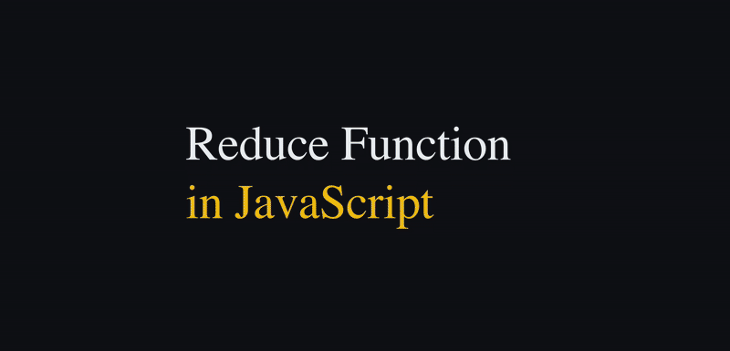

  

# 👋 Hello, I'm Minh!

🧑‍🎓 I'm a final-year student majoring in **Software Engineering** at HUTECH University.  
🎨 During my academic journey, I spent nearly 3 years exploring the world of **Graphic Design**, stepping away from my core field for a while.

✨ But deep down, I've always been passionate about **technology and coding** — and recently, I’ve decided to return to this path with full commitment.  
Although I started taking coding seriously only about **6 months ago**, I move forward every day with purpose and determination.

🚀 Right now, I’m focusing on **rebuilding my skills** from the ground up and developing real-world projects to strengthen my foundation.  
💬 Things might still look a bit rough, but I’m excited to **learn, grow**, and **share my journey** with everyone here.

📈 I may have started later than others,  
but I’ll never stop **learning**, exploring **new languages**, mastering **new frameworks**,  
and continuously pushing myself to grow — not just for myself, but also to contribute to the teams, companies, and communities I’ll work with in the future.

---

### 📚 What I'm focusing on:
- Strengthening core programming knowledge
- Building real-world, impactful projects
- Learning modern tools, libraries, and frameworks

---

### 🌱 A few things about me:
- Former graphic design enthusiast 🎨
- Passionate about technology and creativity 🚀
- Always open to learning and experimenting 🌟

---

### ❤️ What I Love to Do:

- 💡 Turn ideas into real, usable apps  
- 🎨 Obsessed with beautiful UI/UX — I love discovering stunning websites and wondering _"How was this made?"_
- 🔄 Blend creativity with logic — design with purpose, code with structure  
- ✍️ Love writing code (even when debugging drives me crazy 😅)  
- 🧠 Always curious and eager to explore new technologies  
- 🤝 Believe in building meaningful, helpful tools — no matter how big or small

---

### 💻 Languages & Tools I Use:

#### 🔤 Programming Languages:

#### 🧰 Frameworks & Platforms:

#### 🗃️ Databases:

#### 🎨 Design Tools:

---

### 📫 How to reach me:
- 📨 doanmihh1533@gmail.com  
- 💻 Personal website: _coming soon_ ☺️

---

Thanks for visiting! 🌟  
_I'm just getting started — and there's a lot more to come!_
